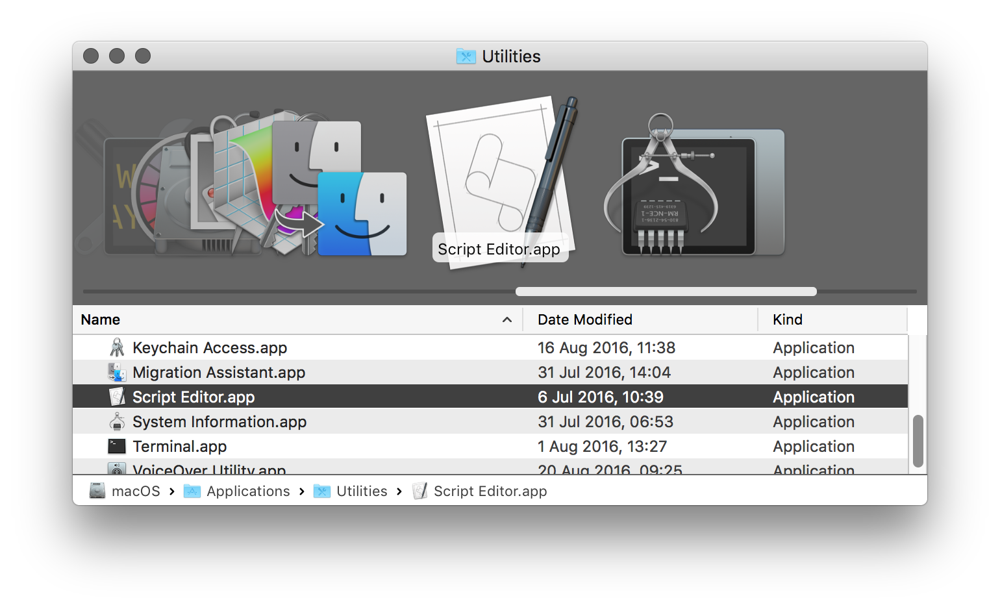
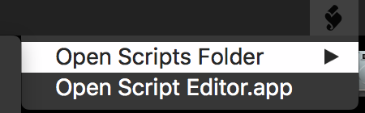

# Manual Installation

**1.** Open AppleScript Editor OR Script Editor (the names of default apps is changed in later macOS versions) from the Utilities folder in /Applications/Utilities 

**2.** Click 'AppleScript Editor' on the top left corner of the menu bar.

**3.** A drop down menu should appear. Click on 'Preferences…' (or you can use ⌘ ,)

**4.** A window should appear. Select the General tab.

**5.** Click the 'Show Script menu in menu bar' if it doesn't have a check mark already.

**6.** The Script icon should appear in the menu bar, then click on the Script icon.

**7.** Select 'Open Scripts Folder' if you want to add the scripts to only the current account you're using. From here you can place the script files anywhere you want in that location. I recommend creating a folder for it so it doesn't get messy.

**8.** Mouse over the 'Open Scripts Folder' option and wait a few seconds for another drop down menu to appear. Click 'Open User Scripts Folder'. This will bring you to a folder located under ``~/Library/Scripts/``. Drag the Scripts Pack Folder into that folder.

## Add as System Scripts
**9.** If you want to install it under the System Scripts folder under ``/Library/Scripts/``, you can do so by choosing the 'Open Computer Scripts' option instead (or by navigating there yourself). You'll need to authenticate with a administrator's password. This is a bit more secure as other applications will be unable to modify these scripts without the appropriate priviledges. If you wish to install them for your user only see step 6.

**10.** The scripts should appear now when you click the script icon in the menu bar when placed in the appropriate Scripts folders.

**11.**  Enjoy! If you're not satisfied or find these scripts useless I would recommended deleting them immediately (by dragging them to the trash and emptying it) to avoid the pain when you use these scripts! You can also make an alias into the user scripts folder that link to these scripts. You don't actually have to drag the folder there. You cannot use the automated installer to remove the Scripts Pack. You'll just have to delete the folder to remove it.

## What what!? It didn't work!

If the steps provided above didn't work for you, use the Simple Installer located in the main directory of the Scripts Pack Disk image. You should see the installer icon over the 'Install' button. Double-click that icon and click 'Run' if opened in the AppleScript Editor. Then follow the steps provided. Please read the 'Manual Removal' file for information how to remove the Scripts Pack without using any automated remover.
